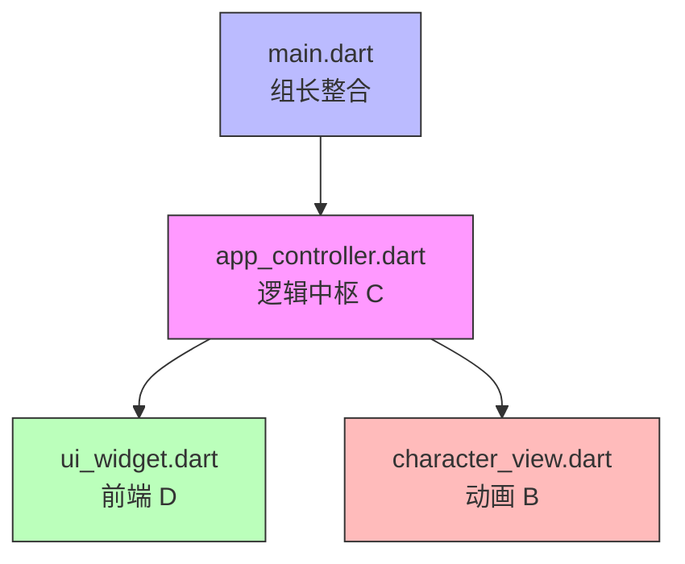
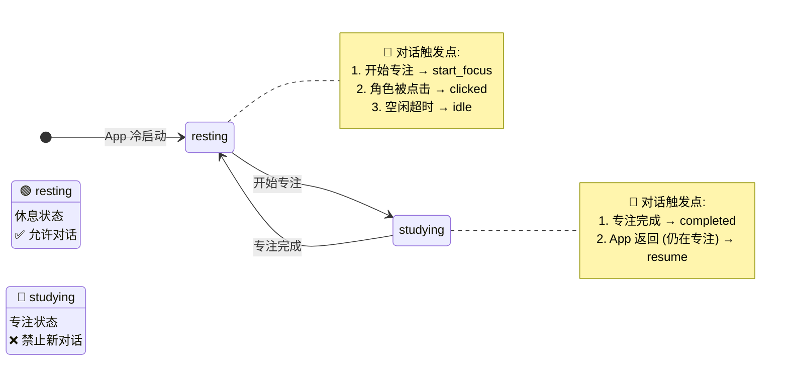

# 陪伴学习软件 - 项目接口规范手册

> **版本**: v5.0  
> **最后更新**: 2026.3.23
> **适用对象**: 开发团队成员、AI 助手 (Claude)  
> **协作原则**: 接口契约优先，模块内部实现自治

---

## 1. 项目概述

### 1.1 核心概念
这是一个旨在通过"虚拟伴侣"提升用户专注力的番茄钟生产力应用。应用主界面模拟图书馆环境，核心交互角色为 Live2D 角色 Hiyori，她坐在用户对面陪同学习。

### 1.2 技术栈
| 组件 | 技术选型 |
| :--- | :--- |
| 开发框架 | Flutter (Dart) |
| 动画引擎 | Live2D Cubism SDK |
| 状态管理 | ValueNotifier + ChangeNotifier 混合方案 |
| 本地存储 | SharedPreferences / Hive |
| 协作工具 | Git (GitHub) |

### 1.3 文件架构
```
lib/
├── main.dart                 # 全栈架构师 (组长)
├── app_controller.dart       # 系统后端工程师 (组员 C)
├── ui_widget.dart            # 前端交互工程师 (组员 D)
├── character_view.dart       # 图形引擎工程师 (组员 B)
└── models/
    └── user_stats.dart       # 数据模型定义 (共享)

assets/
├── dialogues.json            # 对话文本
├── tips.json                 # Tips 库
├── background.webp           # 背景图
└── character/                # Live2D 模型文件
```

---

## 2. 架构说明：逻辑中枢模式

### 2.1 协作拓扑图


### 2.2 状态管理策略
| 状态类型 | 技术方案 | 适用场景 | 所属模块 |
| :--- | :--- | :--- | :--- |
| **简单值状态** | `ValueNotifier<T>` | 倒计时、布尔开关、数值 | `app_controller.dart` (现有) |
| **复杂交互状态** | `ChangeNotifier` | 对话系统、多变量关联 | `app_controller.dart` (新增) |

**核心原则**: 
- `ValueNotifier` 用于高频更新 (如倒计时每秒变化)
- `ChangeNotifier` 用于低频状态变更 (如对话触发、业务状态切换)
- 状态只在 `app_controller.dart` 修改，其他模块只监听、不修改

---

## 3. 状态广播接口 (State Interfaces)

### 3.1 ValueNotifier 状态 (现有，组员 C 维护)
| 变量名 | 类型 | 描述 | 使用者 | 更新频率 |
| :--- | :--- | :--- | :--- | :--- |
| `remainingSeconds` | `ValueNotifier<int>` | 倒计时秒数 (默认 1500 秒) | 组员 D (进度条/数字) | 高频 (每秒) |
| `isActive` | `ValueNotifier<bool>` | 计时器运行状态 | 组员 B (动画) / 组员 D (按钮) | 低频 |
| `isDrawerOpen` | `ValueNotifier<bool>` | 上拉菜单状态 | 组长 A (布局调整) | 低频 |
| `currentDate` | `ValueNotifier<String>` | 格式化日期 (如"2026 年 1 月 13 日") | 组员 D (顶部显示) | 极低频 |

### 3.2 ChangeNotifier 状态 (新增，对话系统)
| 变量名 | 类型 | 描述 | 持久化 | 使用者 |
| :--- | :--- | :--- | :--- | :--- |
| `isTalking` | `bool` | 是否处于对话状态 | ❌ | 组员 D (气泡显示) / 组员 B (动画) |
| `currentDialogue` | `String` | 当前显示的对话文本 | ❌ | 组员 D (气泡内容) |
| `tomatoState` | `enum` | 业务状态 (studying/resting) | ❌ | 组员 B (动画) / 组员 D (UI) |
| `focusStartTime` | `DateTime?` | 专注开始时间戳 | ✅ | 组员 C (时间同步) |

### 3.3 业务状态枚举
```dart
enum TomatoState {
  resting,    // 休息中 (冷启动默认)
  studying,   // 专注中
}
```

### 3.4 对话类型枚举
```dart
enum DialogueType {
  clicked,        // 角色被点击
  completed,      // 任务完成
  idle,           // 空闲超时
  resume,         // App 返回 (仍在专注)
  start_focus,    // 开始专注
}
```

---

## 4. 逻辑触发接口 (Method Interfaces)

### 4.1 后端模块 (app_controller.dart) - 组员 C

**职责**: 状态源 (Single Source of Truth)、对话逻辑、数据加载

#### 4.1.1 类定义
```dart
class AppController extends ChangeNotifier {
  // ============ ValueNotifier 状态 (现有) ============
  final ValueNotifier<int> remainingSeconds;
  final ValueNotifier<bool> isActive;
  final ValueNotifier<bool> isDrawerOpen;
  final ValueNotifier<String> currentDate;
  
  // ============ ChangeNotifier 状态 (对话系统新增) ============
  bool _isTalking = false;
  String _currentDialogue = '';
  TomatoState _tomatoState = TomatoState.resting;
  DateTime? _focusStartTime;
  
  // ============ 状态读取接口 (Getter) ============
  bool get isTalking => _isTalking;
  String get currentDialogue => _currentDialogue;
  TomatoState get tomatoState => _tomatoState;
  DateTime? get focusStartTime => _focusStartTime;
  
  // ============ 状态变更接口 (Public Methods) ============
  void triggerDialogue(String type);
  void nextDialogue();
  void skipDialogue();
  void setTomatoState(TomatoState newState);
  void handleAppResume();
  void startFocus();
  void finishFocus();
  
  // ============ 生命周期接口 ============
  Future<void> loadData();
  Future<void> saveData();
  
  // ============ 资源释放 ============
  void dispose();
}
```

#### 4.1.2 方法详细规格
| 方法名 | 参数 | 返回值 | 副作用 | 调用方 |
| :--- | :--- | :--- | :--- | :--- |
| `triggerDialogue` | `type: String` | `void` | 加载队列、`notifyListeners()` | B / C / main |
| `nextDialogue` | 无 | `void` | 索引++、`notifyListeners()` | D |
| `skipDialogue` | 无 | `void` | 重置状态、`notifyListeners()` | D |
| `setTomatoState` | `newState: TomatoState` | `void` | 状态变更、`notifyListeners()` | D / main |
| `handleAppResume` | 无 | `void` | 时间同步、`notifyListeners()` | main |
| `startFocus` | 无 | `void` | 进入 studying、`notifyListeners()` | D |
| `finishFocus` | 无 | `void` | 进入 resting、`notifyListeners()` | C (计时器) |
| `loadData` | 无 | `Future<void>` | 从本地存储加载 | main |
| `saveData` | 无 | `Future<void>` | 保存到本地存储 | C 内部 |
| `toggleTimer` | 无 | `void` | 切换计时器状态 | D |
| `resetTimer` | 无 | `void` | 重置番茄钟 | D |
| `fetchHistoryData` | 无 | `void` | 读取历史时长 | D |

#### 4.1.3 状态变更通知机制
```dart
// ValueNotifier 状态变更
remainingSeconds.value = newValue;  // 自动通知监听者

// ChangeNotifier 状态变更
_isTalking = true;
notifyListeners();  // 手动通知监听者
```

#### 4.1.4 对话优先级规则
| 业务状态 | 允许触发对话 | 说明 |
| :--- | :--- | :--- |
| `TomatoState.resting` | ✅ | 休息状态，允许对话 |
| `TomatoState.studying` | ❌ | 专注中，禁止新对话 (resume 除外) |

---

### 4.2 前端模块 (ui_widget.dart) - 组员 D

**职责**: UI 展示、用户交互捕获

#### 4.2.1 依赖注入接口
```dart
class DialogueUI extends StatelessWidget {
  final AppController controller;  // 必须通过构造函数注入
  
  const DialogueUI({required this.controller});
}
```

#### 4.2.2 状态监听接口
```dart
// 方式 1: 监听 ChangeNotifier (对话状态)
ListenableBuilder(
  listenable: controller,
  builder: (context, child) {
    if (controller.isTalking) {
      return buildDialogueOverlay();
    } else {
      return SizedBox.shrink();
    }
  },
)

// 方式 2: 监听 ValueNotifier (倒计时等)
ValueListenableBuilder<int>(
  valueListenable: controller.remainingSeconds,
  builder: (context, value, child) {
    return Text(_formatTime(value));
  },
)
```

#### 4.2.3 用户交互接口
| 交互事件 | 调用方法 | 说明 |
| :--- | :--- | :--- |
| 点击 Skip 按钮 | `controller.skipDialogue()` | 退出对话 |
| 点击气泡外区域 | `controller.nextDialogue()` | 下一条对话 |
| 点击开始专注按钮 | `controller.startFocus()` | 进入专注状态 |
| 点击 UI 功能按钮 | 直接执行按钮逻辑 | 对话中允许操作 |

#### 4.2.4 遮罩层行为规范
```dart
// 透明遮罩层必须设置 HitTestBehavior.translucent
GestureDetector(
  behavior: HitTestBehavior.translucent,  // 允许事件穿透到下层 UI
  onTap: () => controller.nextDialogue(),
  child: Container(color: Colors.transparent),
)
```

---

### 4.3 动画模块 (character_view.dart) - 组员 B

**职责**: 根据业务状态播放对应动画

#### 4.3.1 依赖注入接口
```dart
class CharacterView extends StatefulWidget {
  final AppController controller;  // 必须通过构造函数注入
  
  const CharacterView({required this.controller});
}
```

#### 4.3.2 状态监听接口
```dart
// 监听 ChangeNotifier (业务状态、对话状态)
controller.addListener(() {
  _updateMotion();
});
```

#### 4.3.3 动画状态映射
| 业务状态 | Live2D 动作 | 调用方法 |
| :--- | :--- | :--- |
| `TomatoState.studying` | `study` (学习) | `playMotion("study")` |
| `TomatoState.resting` | `idle` (待机) | `playMotion("idle")` |
| `isTalking = true` | `talk` (说话) | `playMotion("talk")` |

#### 4.3.4 角色点击接口
```dart
// 点击角色时触发对话
GestureDetector(
  onTap: () {
    if (!controller.isTalking && controller.tomatoState == TomatoState.resting) {
      controller.triggerDialogue("clicked");
    }
  },
  child: Live2DWidget(),
)
```

---

### 4.4 架构模块 (main.dart) - 组长

**职责**: 初始化、依赖注入、生命周期监听

#### 4.4.1 初始化接口
```dart
void main() async {
  WidgetsFlutterBinding.ensureInitialized();
  
  final appController = AppController();
  await appController.loadData();  // 加载持久化数据
  
  runApp(
    MaterialApp(
      home: Scaffold(
        body: Stack(
          children: [
            CharacterView(controller: appController),
            DialogueUI(controller: appController),
          ],
        ),
      ),
    ),
  );
}
```

#### 4.4.2 生命周期监听接口
```dart
class _MyAppState extends State<MyApp> with WidgetsBindingObserver {
  @override
  void initState() {
    super.initState();
    WidgetsBinding.instance.addObserver(this);
  }
  
  @override
  void didChangeAppLifecycleState(AppLifecycleState state) {
    if (state == AppLifecycleState.resumed) {
      appController.handleAppResume();
    }
  }
  
  @override
  void dispose() {
    WidgetsBinding.instance.removeObserver(this);
    super.dispose();
  }
}
```

---

## 5. 业务状态流转规则

### 5.1 状态流转图


### 5.2 对话触发条件总览
| ID | 触发场景 | 业务状态 | 对话类型 | 检测模块 | 调用方法 |
| :--- | :--- | :--- | :--- | :--- | :--- |
| Ⅰ | 角色被点击 | resting | clicked | character_view.dart (B) | `triggerDialogue("clicked")` |
| Ⅱ | 番茄钟任务完成 | studying→resting | completed | app_controller.dart (C) | `finishFocus()` |
| Ⅲ | 用户空闲超时 | resting | idle | app_controller.dart (C) | `triggerDialogue("idle")` |
| Ⅳ | App 离开重进 (仍在专注) | studying | resume | main.dart (组长) | `handleAppResume()` |
| Ⅴ | 开始专注 | resting→studying | start_focus | ui_widget.dart (D) | `startFocus()` |

### 5.3 App 返回时的状态同步
| 返回时状态 | 时间判断 | 预期行为 | 对话触发 |
| :--- | :--- | :--- | :--- |
| `studying` | 剩余时间 > 0 | 同步剩余时间 | `resume` |
| `studying` | 剩余时间 ≤ 0 | 状态同步为 resting | `completed` |
| `resting` | - | 保持 resting | 无 |

---

## 6. 用户交互优先级规则

| 优先级 | 点击区域 | 预期行为 | 负责模块 |
| :--- | :--- | :--- | :--- |
| P1 (最高) | Skip 按钮 | `skipDialogue()` | ui_widget.dart |
| P2 | UI 功能按钮 | 执行按钮逻辑 (对话保持) | ui_widget.dart |
| P3 | 角色点击 | `triggerDialogue("clicked")` (仅 resting 状态) | character_view.dart |
| P4 (最低) | 空白区域 | `nextDialogue()` | ui_widget.dart |

---

## 7. 资源路径规范

所有资源必须存放在项目根目录的 `assets/` 文件夹下，并在 `pubspec.yaml` 中注册：

```yaml
flutter:
  assets:
    - assets/background.webp
    - assets/character/model.model3.json
    - assets/dialogues.json
    - assets/tips.json
    - assets/Placeholder.png
```

| 资源类型 | 路径 | 说明 |
| :--- | :--- | :--- |
| 背景图 | `assets/background.webp` | 横屏图书馆背景 |
| Live2D 模型 | `assets/character/model.model3.json` | Hiyori 模型入口文件 |
| 对话文本 | `assets/dialogues.json` | 对话内容配置 |
| Tips 库 | `assets/tips.json` | 自律 Tips 配置 |
| 占位图 | `assets/Placeholder.png` | 加载占位图 |

---

## 8. 边界情况处理 (Edge Cases)

| 场景 | 预期行为 | 负责模块 |
| :--- | :--- | :--- |
| 对话队列索引超出范围 | 自动调用 `skipDialogue()` | app_controller.dart |
| 对话中触发新对话 | 打断当前对话，加载新队列 | app_controller.dart |
| JSON 文件加载失败 | 使用默认备用文本 | app_controller.dart |
| 对话中 UI 按钮点击 | 按钮逻辑执行 + 对话保持 | ui_widget.dart |
| 对话中角色点击 | 无响应 (对话中禁用) | character_view.dart |
| App 后台切换 | 保持对话状态不变 | app_controller.dart |
| 专注中触发对话 | 忽略，不触发 (resume 除外) | app_controller.dart |
| 专注中角色点击 | 无响应 (专注中禁用) | character_view.dart |

---

## 9. 开发检查清单 (Development Checklist)

### 9.1 组员 C (后端)
- [ ] 保留现有 `ValueNotifier` 状态变量
- [ ] 新增 `ChangeNotifier` 继承 (对话系统)
- [ ] 实现所有公共方法接口
- [ ] 确保 ChangeNotifier 状态变化调用 `notifyListeners()`
- [ ] 确保 ValueNotifier 状态变化使用 `.value = newValue`
- [ ] 实现 JSON 加载逻辑
- [ ] 实现数据持久化 (`loadData`/`saveData`)
- [ ] 实现对话优先级规则检查
- [ ] 实现 `dispose()` 方法释放所有资源

### 9.2 组员 D (前端)
- [ ] 实现依赖注入 (构造函数接收 controller)
- [ ] 实现 `ListenableBuilder` 状态监听 (ChangeNotifier)
- [ ] 实现 `ValueListenableBuilder` 状态监听 (ValueNotifier)
- [ ] 实现 Skip 按钮点击处理
- [ ] 实现气泡外点击处理
- [ ] 实现遮罩层 `HitTestBehavior.translucent`
- [ ] 实现开始专注按钮 (`startFocus()`)
- [ ] 测试对话中 UI 按钮可点击

### 9.3 组员 B (动画)
- [ ] 实现依赖注入 (构造函数接收 controller)
- [ ] 实现 `addListener` 状态监听
- [ ] 实现业务状态到动画动作的映射
- [ ] 实现角色点击检测
- [ ] 实现对话中/专注中禁用新对话触发

### 9.4 组长 (架构)
- [ ] 创建 `dialogues.json` 文件
- [ ] 配置 `assets` 路径
- [ ] 实现 `WidgetsBindingObserver` 生命周期监听
- [ ] 实现依赖注入
- [ ] 组织接口联调测试
- [ ] 确保 `dispose()` 正确调用

---

## 10. 版本历史 (Version History)

| 版本 | 日期 | 变更说明 |
| :--- | :--- | :--- |
| v1.0 | 2026.1 | 初始版本，定义 MVP 核心接口 |
| v2.0 | 2026.2 | 新增对话系统接口规范 |
| v3.0 | 2026.3 | 分离业务状态与交互状态 |
| v4.0 | 2026.3.15 | 采用 ValueNotifier+ChangeNotifier 混合方案 |
| v5.0 | 2026.3.18 | 删除 `continue_focus` 类型，用 `resume` 代替 App 返回场景 |

---

## 11. 附录：快速参考 (Quick Reference)

### 11.1 状态读取速查
```dart
// ChangeNotifier 状态
controller.isTalking;           // 是否正在对话
controller.currentDialogue;     // 当前对话文本
controller.tomatoState;         // 业务状态
controller.focusStartTime;      // 专注开始时间

// ValueNotifier 状态
controller.remainingSeconds.value;  // 倒计时秒数
controller.isActive.value;          // 计时器运行状态
controller.isDrawerOpen.value;      // 菜单状态
controller.currentDate.value;       // 当前日期
```

### 11.2 接口调用速查
```dart
// 对话系统
controller.triggerDialogue("clicked");    // 触发对话
controller.nextDialogue();                // 下一条
controller.skipDialogue();                // 跳过

// 番茄钟系统
controller.startFocus();                  // 开始专注
controller.finishFocus();                 // 完成专注
controller.handleAppResume();             // App 返回处理
controller.toggleTimer();                 // 切换计时器
controller.resetTimer();                  // 重置计时器

// 数据系统
controller.loadData();                    // 加载数据
controller.fetchHistoryData();            // 获取历史数据
```

### 11.3 混合方案速查
```dart
// ValueNotifier 变更 (高频)
controller.remainingSeconds.value = 1500;

// ChangeNotifier 变更 (低频)
controller.startFocus();
// 内部会调用 notifyListeners()
```

---

> **文档结束**  
> 如有接口变更，请更新此文档并通知所有组员  
> **协作原则**: 接口契约优先，模块内部实现自治  
> **AI 助手提示**: 本规范供 Claude 理解项目架构和接口逻辑，辅助代码生成和问题解答