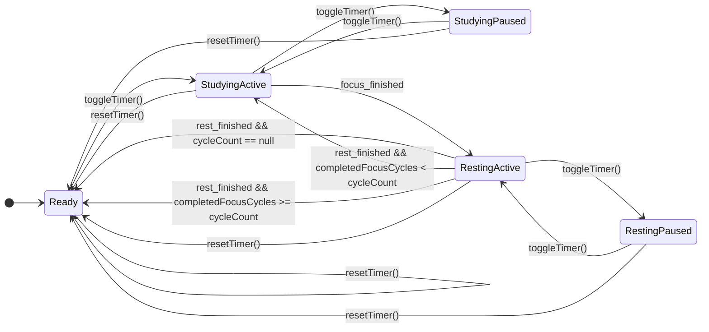

# 番茄钟 State Flow

> 版本：v1.0
> 最后更新：2026-03-24
> 适用范围：`AppController` 番茄钟状态机、阶段流转、生命周期恢复
> 依赖契约：`docs/pomodoro_interface_spec.md`

---

## 1. 目标

本文档用于把番茄钟的**状态流转规则**单独冻结下来，作为后端实现、前端联调、测试用例设计的共同依据。

本文只回答三类问题：
- 当前有哪些业务状态
- 哪些事件会触发状态切换
- 每次切换时，哪些字段必须同步变化

---

## 2. 核心状态

### 2.1 业务状态

冻结业务状态只有两个：

```dart
enum PomodoroState {
  resting,
  studying,
}
```

语义：
- `resting`：休息阶段，或待开始状态
- `studying`：专注阶段

说明：
- 不单独引入 `idle`
- “当前是否正在运行”由 `isActive` 表达，而不是由第三个状态表达

### 2.2 运行状态

```dart
isActive: ValueNotifier<bool>
```

语义：
- `true`：当前阶段正在计时
- `false`：当前阶段未运行、已暂停、或已重置

### 2.3 关键联动字段

每次状态流转都必须同时考虑：
- `pomodoroState`
- `isActive`
- `remainingSeconds`
- `focusDurationSeconds`
- `restDurationSeconds`
- `cycleCount`
- `completedFocusCycles`

---

## 3. 默认状态

冷启动默认状态冻结如下：

| 字段 | 默认值 |
| :--- | :--- |
| `pomodoroState` | `PomodoroState.resting` |
| `isActive` | `false` |
| `remainingSeconds` | `focusDurationSeconds` |
| `focusDurationSeconds` | `1500` |
| `restDurationSeconds` | `300` |
| `cycleCount` | `null` |
| `completedFocusCycles` | `0` |

解释：
- 冷启动时业务语义是“休息/未开始”
- 但屏幕默认展示的倒计时应是“下一轮专注”的默认时长
- 用户首次点击开始后，系统进入第一轮 `studying`

---

## 4. 触发事件定义

| 事件名 | 来源 | 说明 |
| :--- | :--- | :--- |
| `start_or_resume` | `toggleTimer()` | 启动或恢复当前阶段 |
| `pause` | `toggleTimer()` | 暂停当前阶段 |
| `reset` | `resetTimer()` | 回到待开始状态 |
| `focus_finished` | 计时器内部 | 专注阶段自然结束 |
| `rest_finished` | 计时器内部 | 休息阶段自然结束 |
| `rehydrate` | 启动恢复 | 从持久化快照恢复状态 |
| `fetch_history` | `fetchHistoryData()` | 读取历史，不改变核心状态机 |
| `update_focus_duration` | `updateFocusDuration()` | 更新专注时长配置 |
| `update_rest_duration` | `updateRestDuration()` | 更新休息时长配置 |
| `update_cycle_count` | `updateCycleCount()` | 更新循环次数配置 |

---

## 5. 主状态流转

### 5.1 总览图



### 5.2 状态节点定义

#### `Ready`
待开始状态。

固定条件：
- `pomodoroState = resting`
- `isActive = false`
- `remainingSeconds = focusDurationSeconds`

#### `StudyingActive`
专注中，正在运行。

固定条件：
- `pomodoroState = studying`
- `isActive = true`
- `remainingSeconds > 0`

#### `StudyingPaused`
专注中，已暂停。

固定条件：
- `pomodoroState = studying`
- `isActive = false`
- `remainingSeconds > 0`

#### `RestingActive`
休息中，正在运行。

固定条件：
- `pomodoroState = resting`
- `isActive = true`
- `remainingSeconds > 0`

#### `RestingPaused`
休息中，已暂停。

固定条件：
- `pomodoroState = resting`
- `isActive = false`
- `remainingSeconds > 0`

---

## 6. 逐事件流转规则

### 6.1 `toggleTimer()`：从待开始进入专注

前置条件：
- 当前处于 `Ready`

流转结果：
- `pomodoroState: resting -> studying`
- `isActive: false -> true`
- `remainingSeconds` 保持当前专注初始值
- 写入当前专注阶段开始时间

### 6.2 `toggleTimer()`：暂停专注

前置条件：
- 当前处于 `StudyingActive`

流转结果：
- `pomodoroState` 不变
- `isActive: true -> false`
- `remainingSeconds` 保留当前值
- 写入暂停后的快照

### 6.3 `toggleTimer()`：恢复专注

前置条件：
- 当前处于 `StudyingPaused`

流转结果：
- `pomodoroState` 不变
- `isActive: false -> true`
- `remainingSeconds` 保留当前值后继续递减
- 重新写入恢复后的阶段开始时间或恢复基准时间

### 6.4 `focus_finished`

前置条件：
- 当前处于 `StudyingActive`
- `remainingSeconds` 自然归零

流转结果：
- `completedFocusCycles += 1`
- `pomodoroState: studying -> resting`
- `remainingSeconds = restDurationSeconds`
- `isActive` 保持 `true`
- 写入一次专注完成历史
- 切换到休息阶段的运行快照

说明：
- 当前冻结方案默认**专注结束后自动进入休息并继续运行**

### 6.5 `toggleTimer()`：暂停休息

前置条件：
- 当前处于 `RestingActive`

流转结果：
- `pomodoroState` 不变
- `isActive: true -> false`
- `remainingSeconds` 保留当前值

### 6.6 `toggleTimer()`：恢复休息

前置条件：
- 当前处于 `RestingPaused`

流转结果：
- `pomodoroState` 不变
- `isActive: false -> true`
- `remainingSeconds` 保留当前值后继续递减

### 6.7 `rest_finished`

前置条件：
- 当前处于 `RestingActive`
- `remainingSeconds` 自然归零

分支结果：

#### 分支 A：`cycleCount == null`
- 回到 `Ready`
- 不自动开始下一轮专注

#### 分支 B：`cycleCount != null && completedFocusCycles < cycleCount`
- 进入下一轮 `StudyingActive`
- `pomodoroState = studying`
- `isActive = true`
- `remainingSeconds = focusDurationSeconds`
- 写入下一轮专注开始时间

#### 分支 C：`cycleCount != null && completedFocusCycles >= cycleCount`
- 回到 `Ready`
- 不再继续新一轮专注

### 6.8 `resetTimer()`

允许来源：
- `Ready`
- `StudyingActive`
- `StudyingPaused`
- `RestingActive`
- `RestingPaused`

统一结果：
- `pomodoroState = resting`
- `isActive = false`
- `remainingSeconds = focusDurationSeconds`
- `completedFocusCycles = 0`
- 清除当前运行快照
- 不写入新的历史完成记录

---

## 7. 启动恢复（Rehydrate）规则

### 7.1 恢复目标

恢复逻辑必须基于持久化快照，而不是假设内存状态仍然可信。

至少依赖：
- 当前阶段开始时间
- 当前阶段类型
- 当前阶段总时长
- 当前是否正在运行
- 已完成专注轮次
- 当前配置值

### 7.2 恢复分支

#### 情况 A：没有活跃快照
- 进入 `Ready`

#### 情况 B：有快照，但 `isActive = false`
- 恢复到对应的暂停状态：
  - `StudyingPaused` 或 `RestingPaused`

#### 情况 C：有快照，且仍在有效时间窗内
- 恢复到对应的运行状态：
  - `StudyingActive` 或 `RestingActive`
- `remainingSeconds` 由“阶段总时长 - 已流逝时间”推导

#### 情况 D：有快照，但阶段已超时
- 不停留在过期阶段
- 必须立即执行对应完成逻辑：
  - 专注超时 -> 按 `focus_finished` 推进
  - 休息超时 -> 按 `rest_finished` 推进

---

## 8. 非流转事件

以下事件**不能**改变核心状态机：

- `fetchHistoryData()`
- `updateFocusDuration()`
- `updateRestDuration()`
- `updateCycleCount()`

它们可以：
- 更新配置
- 更新历史数据
- 更新默认展示值（在未运行前提下）

但不能：
- 偷偷推进 `studying/resting`
- 偷偷重置 `completedFocusCycles`
- 偷偷启动或停止当前计时

---

## 9. 测试断言建议

以下断言应在实现与测试中固定下来：

1. 冷启动默认进入 `Ready`
2. 首次 `toggleTimer()` 必须进入 `StudyingActive`
3. 专注结束必须先累加 `completedFocusCycles`，再进入休息
4. `cycleCount = null` 时，休息结束必须回到 `Ready`
5. `cycleCount = N` 时，总专注完成轮次不得超过 `N`
6. `resetTimer()` 在任何阶段都必须回到 `Ready`
7. 恢复到过期快照时，不得停留在已过期状态

---

## 10. 参考文档

- `docs/pomodoro_interface_spec.md`
- `docs/番茄钟功能简要.md`
- `lib/app_controller.dart`
- `lib/ui_widgets.dart`
- `lib/main.dart`
