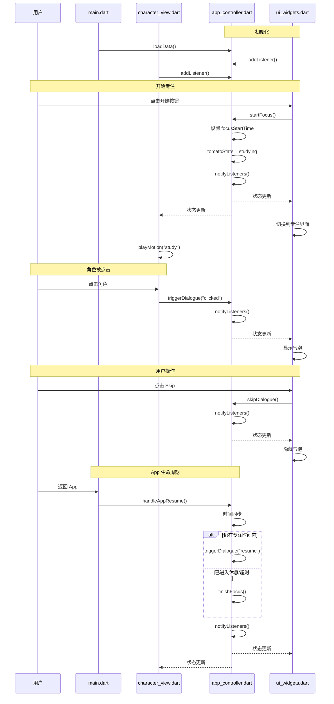

# 对话与 Tips 系统 - Interface Specification 

> **版本**: v4.0  
> **最后更新**: 2026.3.18  
> **适用模块**: 对话系统 (Dialogue & Tips System)  
> **架构模式**: ValueNotifier + ChangeNotifier 混合状态管理 + 模块化分工  
> **协作原则**: 接口契约优先，模块内部实现自治

---

## 1. 系统概述 (System Overview)

### 1.1 功能描述
在合适的业务场景下，通过前端 UI 气泡展示对话内容，提供自律 Tips 和情感陪伴。**对话框由前端独立渲染，与动画模块解耦**。

### 1.2 业务状态 (Business State)
| 状态       | 说明            | 冷启动默认 |
| :--------- | :-------------- | :--------- |
| `resting`  | 休息状态/未开始 | ✅ 是       |
| `studying` | 专注状态        | ❌ 否       |

**注意**: 冷启动直接进入 `resting`。

### 1.3 触发条件
| ID   | 触发场景                    | 检测模块              | 对话类型      | 优先级 |
| :--- | :-------------------------- | :-------------------- | :------------ | :----- |
| Ⅰ    | 角色被点击                  | `character_view.dart` | `clicked`     | P3     |
| Ⅱ    | 番茄钟任务完成              | `app_controller.dart` | `completed`   | P1     |
| Ⅲ    | 用户空闲超时                | `app_controller.dart` | `idle`        | P4     |
| Ⅳ    | App 离开重进 (仍在专注)     | `main.dart` (组长)    | `resume`      | P2     |
| Ⅴ    | 开始专注 (resting→studying) | `app_controller.dart` | `start_focus` | P1     |

### 1.4 对话类型说明
| 对话类型      | 触发时机                  | 示例文本                         |
| :------------ | :------------------------ | :------------------------------- |
| `start_focus` | 从 resting 进入 studying  | "好的，开始工作咯！"             |
| `completed`   | studying 结束进入 resting | "好耶，专注成功！休息一下吧。"   |
| `resume`      | App 返回时仍在专注时间内  | "让我们接着工作吧！"             |
| `clicked`     | 角色被点击 (resting 状态) | "你好呀~ 今天也要加油哦！"       |
| `idle`        | resting 状态空闲超时      | "你知道吗？多喝水有助于专注哦。" |

---

## 2. 状态管理架构 (State Management Architecture)

### 2.1 混合方案说明

| 状态类型         | 技术方案           | 适用场景               | 所属模块                     |
| :--------------- | :----------------- | :--------------------- | :--------------------------- |
| **简单值状态**   | `ValueNotifier<T>` | 倒计时、布尔开关、数值 | `app_controller.dart` (现有) |
| **复杂交互状态** | `ChangeNotifier`   | 对话系统、多变量关联   | `app_controller.dart` (新增) |

### 2.2 状态变量分类

#### 2.2.1 ValueNotifier 状态 (现有，组员 C 维护)
| 变量名             | 类型                    | 说明           |
| :----------------- | :---------------------- | :------------- |
| `remainingSeconds` | `ValueNotifier<int>`    | 倒计时秒数     |
| `isActive`         | `ValueNotifier<bool>`   | 计时器运行状态 |
| `isDrawerOpen`     | `ValueNotifier<bool>`   | 上拉菜单状态   |
| `currentDate`      | `ValueNotifier<String>` | 当前日期       |

#### 2.2.2 ChangeNotifier 状态 (新增，对话系统)
| 变量名            | 类型        | 说明                        | 持久化       |
| :---------------- | :---------- | :-------------------------- | :----------- |
| `isTalking`       | `bool`      | 是否处于对话状态            | ❌            |
| `currentDialogue` | `String`    | 当前显示的对话文本          | ❌            |
| `tomatoState`     | `enum`      | 业务状态 (studying/resting) | ❌            |
| `focusStartTime`  | `DateTime?` | 专注开始时间戳              | ✅ (本地存储) |

---

## 3. 模块接口定义 (Module Interfaces)

### 3.1 后端模块 (app_controller.dart) - 组	员 C

**职责**: 状态源 (Single Source of Truth)、对话逻辑、数据加载

**对话文档存储位置**: 对话文本配置文件储存在 `assets/dialogues.json` 中，由 `app_controller.dart` 在加载阶段读取。若后续文件名统一调整为 `assets/dialogue.json`，需同步更新本文档、资源声明与加载代码，避免接口文档与实际资源路径不一致。

#### 3.1.1 类定义 (混合方案)
```dart
class AppController extends ChangeNotifier {
  // ============ ValueNotifier 状态 (现有) ============
  final ValueNotifier<int> remainingSeconds;
  final ValueNotifier<bool> isActive;
  final ValueNotifier<bool> isDrawerOpen;
  final ValueNotifier<String> currentDate;
  
  // ============ ChangeNotifier 状态 (对话系统新增) ============
  bool _isTalking = false;
  String _currentDialogue = '';
  TomatoState _tomatoState = TomatoState.resting;  // 冷启动默认 resting
  DateTime? _focusStartTime;  // 专注开始时间戳 (持久化)
  
  // ============ 状态读取接口 (Getter) ============
  bool get isTalking => _isTalking;
  String get currentDialogue => _currentDialogue;
  TomatoState get tomatoState => _tomatoState;
  DateTime? get focusStartTime => _focusStartTime;
  
  // ============ 状态变更接口 (Public Methods) ============
  void triggerDialogue(String type);
  void nextDialogue();
  void skipDialogue();
  void setTomatoState(TomatoState newState);
  void handleAppResume();
  void startFocus();  // 开始专注 (resting → studying)
  void finishFocus(); // 完成专注 (studying → resting)
  
  // ============ 生命周期接口 (Lifecycle) ============
  Future<void> loadData();   // 从本地存储加载
  Future<void> saveData();   // 保存到本地存储
  
  // ============ 资源释放 ============
  void dispose() {
    remainingSeconds.dispose();
    isActive.dispose();
    isDrawerOpen.dispose();
    currentDate.dispose();
    super.dispose();  // ChangeNotifier 释放
  }
}
```

#### 3.1.2 接口行为规格
| 方法名            | 参数                    | 返回值         | 副作用                             | 调用方       |
| :---------------- | :---------------------- | :------------- | :--------------------------------- | :----------- |
| `triggerDialogue` | `type: String`          | `void`         | 加载队列、`notifyListeners()`      | B / C / main |
| `nextDialogue`    | 无                      | `void`         | 索引++、`notifyListeners()`        | D            |
| `skipDialogue`    | 无                      | `void`         | 重置状态、`notifyListeners()`      | D            |
| `setTomatoState`  | `newState: TomatoState` | `void`         | 状态变更、`notifyListeners()`      | D / main     |
| `handleAppResume` | 无                      | `void`         | 时间同步、`notifyListeners()`      | main         |
| `startFocus`      | 无                      | `void`         | 进入 studying、`notifyListeners()` | D            |
| `finishFocus`     | 无                      | `void`         | 进入 resting、`notifyListeners()`  | C (计时器)   |
| `loadData`        | 无                      | `Future<void>` | 从本地存储加载                     | main         |
| `saveData`        | 无                      | `Future<void>` | 保存到本地存储                     | C 内部       |

#### 3.1.3 状态变更通知机制
```dart
// ValueNotifier 状态变更
remainingSeconds.value = newValue;  // 自动通知监听者

// ChangeNotifier 状态变更
_isTalking = true;
notifyListeners();  // 手动通知监听者
```

#### 3.1.4 对话优先级规则
| 业务状态               | 允许触发对话 | 说明                             |
| :--------------------- | :----------- | :------------------------------- |
| `TomatoState.resting`  | ✅            | 休息状态，允许对话               |
| `TomatoState.studying` | ❌            | 专注中，禁止新对话 (resume 除外) |

#### 3.1.5 业务状态流转规则
```dart
// 开始专注 (resting → studying)
void startFocus() {
  if (_tomatoState == TomatoState.resting) {
    _focusStartTime = DateTime.now();
    _tomatoState = TomatoState.studying;
    _triggerDialogue('start_focus');
    notifyListeners();
    saveData();
  }
}

// 完成专注 (studying → resting)
void finishFocus() {
  if (_tomatoState == TomatoState.studying) {
    _tomatoState = TomatoState.resting;
    _triggerDialogue('completed');
    notifyListeners();
    saveData();
  }
}

// App 返回处理
void handleAppResume() {
  if (_tomatoState == TomatoState.studying && _focusStartTime != null) {
    final elapsed = DateTime.now().difference(_focusStartTime!);
    final remaining = _focusDuration - elapsed;
    
    if (remaining > Duration.zero) {
      // 情况 1: 仍在专注时间内
      _triggerDialogue('resume');
    } else {
      // 情况 2 & 3: 已进入休息/超时
      finishFocus();  // 自动完成本轮
    }
    notifyListeners();
  }
}
```

---

### 3.2 前端模块 (ui_widgets.dart) - 组员 D

**职责**: UI 展示、用户交互捕获

#### 3.2.1 依赖注入接口
```dart
class DialogueUI extends StatelessWidget {
  final AppController controller;  // 必须通过构造函数注入
  
  const DialogueUI({required this.controller});
}
```

#### 3.2.2 状态监听接口 (混合方案)
```dart
// 方式 1: 监听 ChangeNotifier (对话状态)
ListenableBuilder(
  listenable: controller,
  builder: (context, child) {
    if (controller.isTalking) {
      return buildDialogueOverlay();
    } else {
      return SizedBox.shrink();
    }
  },
)

// 方式 2: 监听 ValueNotifier (倒计时等)
ValueListenableBuilder<int>(
  valueListenable: controller.remainingSeconds,
  builder: (context, value, child) {
    return Text(_formatTime(value));
  },
)
```

#### 3.2.3 用户交互接口
| 交互事件         | 调用方法                    | 说明           |
| :--------------- | :-------------------------- | :------------- |
| 点击 Skip 按钮   | `controller.skipDialogue()` | 退出对话       |
| 点击气泡外区域   | `controller.nextDialogue()` | 下一条对话     |
| 点击开始专注按钮 | `controller.startFocus()`   | 进入专注状态   |
| 点击 UI 功能按钮 | 直接执行按钮逻辑            | 对话中允许操作 |

#### 3.2.4 遮罩层行为规范
```dart
// 透明遮罩层必须设置 HitTestBehavior.translucent
GestureDetector(
  behavior: HitTestBehavior.translucent,  // 允许事件穿透到下层 UI
  onTap: () => controller.nextDialogue(),
  child: Container(color: Colors.transparent),
)
```

---

### 3.3 动画模块 (character_view.dart) - 组员 B

**职责**: 根据业务状态播放对应动画

#### 3.3.1 依赖注入接口
```dart
class CharacterView extends StatefulWidget {
  final AppController controller;  // 必须通过构造函数注入
  
  const CharacterView({required this.controller});
}
```

#### 3.3.2 状态监听接口 (混合方案)
```dart
// 监听 ChangeNotifier (业务状态、对话状态)
controller.addListener(() {
  _updateMotion();
});
```

#### 3.3.3 动画状态映射
| 业务状态               | Live2D 动作    | 调用方法              |
| :--------------------- | :------------- | :-------------------- |
| `TomatoState.studying` | `study` (学习) | `playMotion("study")` |
| `TomatoState.resting`  | `idle` (待机)  | `playMotion("idle")`  |
| `isTalking = true`     | `talk` (说话)  | `playMotion("talk")`  |

#### 3.3.4 角色点击接口
```dart
// 点击角色时触发对话
GestureDetector(
  onTap: () {
    if (!controller.isTalking && controller.tomatoState == TomatoState.resting) {
      controller.triggerDialogue("clicked");
    }
  },
  child: Live2DWidget(),
)
```

---

### 3.4 架构模块 (main.dart) - 组长

**职责**: 初始化、依赖注入、生命周期监听

#### 3.4.1 初始化接口
```dart
void main() async {
  WidgetsFlutterBinding.ensureInitialized();
  
  final appController = AppController();
  await appController.loadData();  // 加载持久化数据
  
  runApp(
    MaterialApp(
      home: Scaffold(
        body: Stack(
          children: [
            CharacterView(controller: appController),
            DialogueUI(controller: appController),
          ],
        ),
      ),
    ),
  );
}
```

#### 3.4.2 生命周期监听接口
```dart
class _MyAppState extends State<MyApp> with WidgetsBindingObserver {
  @override
  void initState() {
    super.initState();
    WidgetsBinding.instance.addObserver(this);
  }
  
  @override
  void didChangeAppLifecycleState(AppLifecycleState state) {
    if (state == AppLifecycleState.resumed) {
      appController.handleAppResume();
    }
  }
  
  @override
  void dispose() {
    WidgetsBinding.instance.removeObserver(this);
    super.dispose();
  }
}
```

---

## 4. 接口调用时序 (Sequence Diagram)



---

## 5. 状态优先级规则 (State Priority Rules)

### 5.1 业务状态与交互状态关系
| 业务状态变更         | 交互状态影响            | 说明                   |
| :------------------- | :---------------------- | :--------------------- |
| `resting → studying` | 触发 `start_focus` 对话 | 开始专注               |
| `studying → resting` | 触发 `completed` 对话   | 专注完成               |
| `studying` 状态中    | 禁止新对话触发          | 专注优先 (resume 除外) |

### 5.2 App 返回时的状态同步
| 返回时状态 | 时间判断     | 预期行为           | 对话触发    |
| :--------- | :----------- | :----------------- | :---------- |
| `studying` | 剩余时间 > 0 | 同步剩余时间       | `resume`    |
| `studying` | 剩余时间 ≤ 0 | 状态同步为 resting | `completed` |
| `resting`  | -            | 保持 resting       | 无          |

### 5.3 用户交互优先级
| 优先级    | 点击区域    | 预期行为                                       |
| :-------- | :---------- | :--------------------------------------------- |
| P1 (最高) | Skip 按钮   | `skipDialogue()`                               |
| P2        | UI 功能按钮 | 执行按钮逻辑 (对话保持)                        |
| P3        | 角色点击    | `triggerDialogue("clicked")` (仅 resting 状态) |
| P4 (最低) | 空白区域    | `nextDialogue()`                               |

---

## 6. 边界情况处理 (Edge Cases)

| 场景               | 预期行为                   | 负责模块              |
| :----------------- | :------------------------- | :-------------------- |
| 队列索引超出范围   | 自动调用 `skipDialogue()`  | `app_controller.dart` |
| 对话中触发新对话   | 打断当前对话，加载新队列   | `app_controller.dart` |
| JSON 文件加载失败  | 使用默认备用文本           | `app_controller.dart` |
| 对话中 UI 按钮点击 | 按钮逻辑执行 + 对话保持    | `ui_widgets.dart`      |
| 对话中角色点击     | 无响应 (对话中禁用)        | `character_view.dart` |
| App 后台切换       | 保持对话状态不变           | `app_controller.dart` |
| 专注中触发对话     | 忽略，不触发 (resume 除外) | `app_controller.dart` |
| 专注中角色点击     | 无响应 (专注中禁用)        | `character_view.dart` |

---

## 7. 开发检查清单 (Development Checklist)

### 7.1 组员 C (后端)
- [ ] 保留现有 `ValueNotifier` 状态变量
- [ ] 新增 `ChangeNotifier` 继承 (对话系统)
- [ ] 实现所有公共方法接口
- [ ] 确保 ChangeNotifier 状态变化调用 `notifyListeners()`
- [ ] 确保 ValueNotifier 状态变化使用 `.value = newValue`
- [ ] 实现 JSON 加载逻辑
- [ ] 实现数据持久化 (`loadData`/`saveData`)
- [ ] 实现对话优先级规则检查
- [ ] 实现 `dispose()` 方法释放所有资源
- [ ] **删除 `_currentCycle` 相关逻辑**

### 7.2 组员 D (前端)
- [ ] 实现依赖注入 (构造函数接收 controller)
- [ ] 实现 `ListenableBuilder` 状态监听 (ChangeNotifier)
- [ ] 实现 `ValueListenableBuilder` 状态监听 (ValueNotifier)
- [ ] 实现 Skip 按钮点击处理
- [ ] 实现气泡外点击处理
- [ ] 实现遮罩层 `HitTestBehavior.translucent`
- [ ] 实现开始专注按钮 (`startFocus()`)
- [ ] 测试对话中 UI 按钮可点击

### 7.3 组员 B (动画)
- [ ] 实现依赖注入 (构造函数接收 controller)
- [ ] 实现 `addListener` 状态监听
- [ ] 实现业务状态到动画动作的映射
- [ ] 实现角色点击检测
- [ ] 实现对话中/专注中禁用新对话触发

### 7.4 组长 (架构)
- [ ] 创建 `assets/dialogues.json` 文件
- [ ] 在 `pubspec.yaml` 中注册对话资源路径
- [ ] 实现 `WidgetsBindingObserver` 生命周期监听
- [ ] 实现依赖注入
- [ ] 组织接口联调测试
- [ ] 确保 `dispose()` 正确调用

---

## 8. 版本历史 (Version History)

| 版本 | 变更说明                                                     |
| :--- | :----------------------------------------------------------- |
| v1.0 | 初始版本，定义对话系统核心接口                               |
| v2.0 | 分离业务状态与交互状态，明确对话框由前端独立实现             |
| v3.0 | 移除 idle 业务状态，采用 ValueNotifier+ChangeNotifier 混合方案 |
| v4.0 | 删除 `continue_focus` 类型，用 `resume` 代替 App 返回场景，删除 `_currentCycle` |

---

## 9. 附录：快速参考 (Quick Reference)

### 9.1 对话类型枚举
```dart
enum DialogueType {
  clicked,        // 角色被点击
  completed,      // 任务完成
  idle,           // 空闲超时
  resume,         // App 返回 (仍在专注)
  start_focus,    // 开始专注
}
```

### 9.2 业务状态枚举
```dart
enum TomatoState {
  resting,    // 休息中 (冷启动默认)
  studying,   // 专注中
}
```

### 9.3 状态读取速查
```dart
// ChangeNotifier 状态
controller.isTalking;           // 是否正在对话
controller.currentDialogue;     // 当前对话文本
controller.tomatoState;         // 业务状态
controller.focusStartTime;      // 专注开始时间

// ValueNotifier 状态
controller.remainingSeconds.value;  // 倒计时秒数
controller.isActive.value;          // 计时器运行状态
controller.isDrawerOpen.value;      // 菜单状态
```

### 9.4 接口调用速查
```dart
controller.triggerDialogue("clicked");    // 触发对话
controller.nextDialogue();                // 下一条
controller.skipDialogue();                // 跳过
controller.startFocus();                  // 开始专注
controller.finishFocus();                 // 完成专注
controller.handleAppResume();             // App 返回处理
```

### 9.5 混合方案速查
```dart
// ValueNotifier 变更
controller.remainingSeconds.value = 1500;

// ChangeNotifier 变更
controller.startFocus();
// 内部会调用 notifyListeners()
```

---

> **文档结束**  
> 如有接口变更，请更新此文档并通知所有组员  
> **协作原则**: 接口契约优先，模块内部实现自治oller.triggerDialogue("clicked");    // 触发对话
controller.nextDialogue();                // 下一条
controller.skipDialogue();                // 跳过
controller.startFocus();                  // 开始专注
controller.finishFocus();                 // 完成专注
controller.handleAppResume();             // App 返回处理
```

### 9.5 混合方案速查
```dart
// ValueNotifier 变更
controller.remainingSeconds.value = 1500;

// ChangeNotifier 变更
controller.startFocus();
// 内部会调用 notifyListeners()
```

---

> **文档结束**  
> 如有接口变更，请更新此文档并通知所有组员  
> **协作原则**: 接口契约优先，模块内部实现自治oller.triggerDialogue("clicked");    // 触发对话
