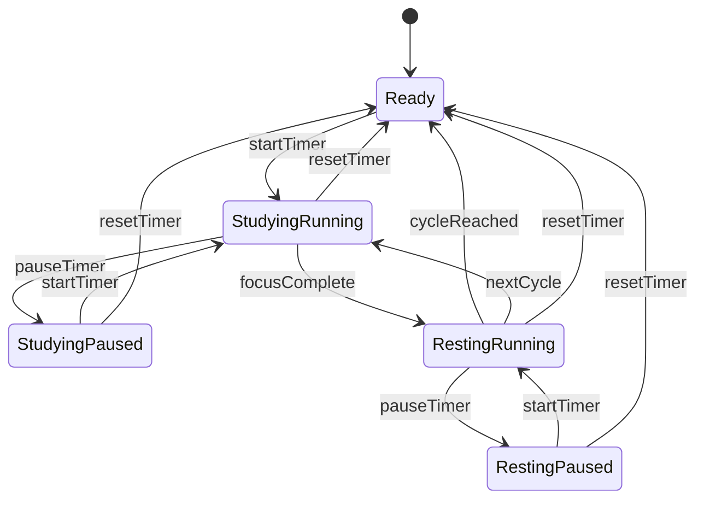

# 后端(app_controller.dart)新功能PRD（审查完善版）

## 1. 文档信息

- 文档版本：v0.2
- 更新日期：2026-03-29
- 文档状态：可进入开发
- 适用范围：`lib/app_controller.dart` 及其本地持久化、通知调度、音频控制逻辑

## 2. 需求背景与目标

### 2.1 背景

当前控制器已具备番茄钟核心状态流转与快照持久化能力，但在三个方向上仍未闭环：

1. 用户切后台时没有专注监管提醒，导致中断后容易流失。
2. 专注行为未沉淀成成长反馈，影响长期留存和对话系统解锁。
3. 音乐栏仍是 UI 占位状态，缺少真实后端播放与音效触发逻辑。

### 2.2 目标

1. 实现后台切出监管：用户专注中离开应用后，在第 3 分钟与第 6 分钟各收到 1 次提醒通知。
2. 实现经验等级系统：专注行为可计算 XP、升级、驱动对话解锁。
3. 实现音乐与音效后端：音乐作为 App 背景音乐自动播放（不依赖是否专注），并在状态切换时触发音效。

### 2.3 成功指标（MVP）

1. 后台提醒触发准确率 >= 95%（Android 真机手测样本 >= 20 次）。
2. XP 计算误差为 0（与规则公式逐例对比）。
3. 音乐栏核心操作成功率 >= 99%（播放/暂停/上一首/下一首/音量）。
4. 重启后状态恢复一致率 >= 95%（专注状态、XP、播放偏好）。

### 2.4 非目标（本期不做）

1. 云端账号同步与跨设备数据一致性。
2. 复杂推荐算法（如个性化歌曲推荐）。
3. 完整历史统计报表（`fetchHistoryData()` 仍保持占位）。

## 3. 用户场景

### 场景 A：专注中切到后台

1. 用户处于 `studying + running`。
2. 用户按 Home 键切到后台。
3. 系统开始后台监管计时。
4. 若 3 分钟内未回到前台，发送第 1 条本地通知提醒。
5. 若 6 分钟内仍未回到前台，发送第 2 条本地通知提醒。
6. 用户回到前台后，取消未触发的监管任务。

### 场景 B：完成专注获得成长反馈

1. 用户完成一次专注阶段。
2. 控制器按规则计算本次 XP。
3. 更新总 XP、当日 XP、等级。
4. 若满足升级条件，触发升级事件供 UI 展示。
5. 对话模块按等级门槛判断是否解锁。

### 场景 C：专注流程中的音乐伴随

1. 用户进入应用后，背景音乐自动播放（无论是否专注）。
2. 用户点击播放栏按钮可覆盖自动播放状态（暂停/恢复）。
3. 进入专注或阶段切换时播放对应音效。
4. 用户下次进入应用可恢复上次播放偏好（曲目、音量、播放状态偏好）。

## 4. 功能需求

## 4.1 后台切出监管系统

### 4.1.1 触发条件

同时满足以下条件才开启后台监管：

1. `pomodoroState == studying`
2. `phaseStatus == running`
3. 应用生命周期从前台进入后台（`inactive/paused`）

### 4.1.2 通知规则

1. 后台持续 >= 180 秒发送第 1 条本地通知。
2. 后台持续 >= 360 秒发送第 2 条本地通知。
3. 每次后台会话最多发送 2 次（仅 3 分钟、6 分钟两个节点）。
4. 通知文案（MVP）
  - 第 1 条标题：专注小提醒
  - 第 1 条内容：你已离开专注超过3分钟，回来继续这次番茄钟吧。
  - 第 2 条标题：专注中断提醒
  - 第 2 条内容：你已离开专注超过6分钟，本轮可能受影响，建议尽快返回。

### 4.1.3 取消条件

满足任一条件即取消待触发提醒：

1. 用户回到前台。
2. 计时被暂停。
3. 计时被重置。
4. 阶段从 `studying` 切换到 `resting/ready`。

### 4.1.4 异常与边界

1. 应用被系统杀死：不强求继续监管，恢复后按快照状态重建。
2. 通知权限未开启：不弹错误，记录失败计数并静默降级。
3. 快速前后台切换（<3 秒）：只保留最后一次有效后台会话。

## 4.2 经验与等级系统

### 4.2.1 经验规则

1. 基础规则：每有效专注 1 分钟 = 10 XP。
2. 计算公式：`xpGain = floor(focusMinutes) * 10 * multiplier`。
3. 默认倍率：`multiplier = 1.0`（后续可扩展连击等加成）。
4. 防作弊规则：单次有效专注 < 5 分钟时，本次 XP = 0。
5. 每日上限：`dailyXpCap = 2000`，超出部分不累计。

### 4.2.2 等级曲线

保留初稿等级曲线，总累计需求 36000 XP。

| 等级 | 升级区间XP | 累计XP门槛 |
| --- | --- | --- |
| LV.1 | - | 0 |
| LV.2 | 50 | 50 |
| LV.3 | 550 | 600 |
| LV.4 | 1400 | 2000 |
| LV.5 | 2500 | 4500 |
| LV.6 | 3500 | 8000 |
| LV.7 | 5000 | 13000 |
| LV.8 | 6500 | 19500 |
| LV.9 | 7500 | 27000 |
| LV.10 | 9000 | 36000 |

### 4.2.3 对话解锁规则

1. 每条受限对话配置 `requiredLevel`。
2. `currentLevel >= requiredLevel` 时可解锁。
3. 解锁条件严格按等级，不叠加任务、连续天数或其他条件。
4. 未达等级返回可读的锁定原因（示例：达到 LV.4 后解锁）。

### 4.2.4 XP 发放时机

1. 默认在专注阶段完成时发放一次（避免每秒写存储）。
2. 如果中途暂停后继续，按本次专注累计有效分钟统一计算。
3. 重置导致专注中断时，不发放未达标的片段 XP。

## 4.3 音乐/音效播放系统

### 4.3.1 音乐播放控制

控制器需支持以下操作：

1. 应用启动后自动播放背景音乐（默认开启）。
2. 播放/暂停。
3. 上一首/下一首。
4. 音量设置（0.0-1.0）。
5. 当前曲目索引读取与持久化。

说明：自动播放策略与专注状态解耦，`resting`、`studying`、`ready` 均可播放。

### 4.3.2 音效触发规则

1. 开始专注（`ready -> studying/running`）播放启动音效。
2. 专注完成进入休息（`studying -> resting`）播放鼓励音效。
3. 休息结束进入新一轮专注时，播放启动音效。
4. 音效播放失败不影响主流程（降级为静默）。

### 4.3.3 资源约束

1. 背景音乐资源目录：`assets/music/`。
2. 音效资源目录：`assets/sfx/`。
3. 资源命名规范：小写蛇形命名，避免中文与空格。

## 5. 控制器接口契约（建议）

在现有 `AppController` 基础上补充/扩展以下接口：

```dart
// 后台监管
void onAppLifecycleChanged(AppLifecycleState state);

// 经验等级
ValueNotifier<int> totalXp;
ValueNotifier<int> dailyXp;
ValueNotifier<int> level;
ValueNotifier<bool> justLeveledUp;
void grantFocusXp({required int effectiveFocusSeconds});
bool canUnlockDialogue(int requiredLevel);

// 音乐系统
ValueNotifier<bool> isMusicPlaying;
ValueNotifier<int> currentTrackIndex;
ValueNotifier<double> musicVolume;
void playOrPauseMusic();
void playNextTrack();
void playPreviousTrack();
void setMusicVolume(double volume);
```

说明：

1. 保持单向状态流：UI 仅监听 Notifier 并调用方法，不直接写状态。
2. 控制器内部负责持久化与边界校验。

## 6. 数据持久化设计

## 6.1 存储方案

MVP 沿用 `shared_preferences`，按模块拆 key，避免大对象耦合。

## 6.2 Key 设计

1. 既有番茄快照：`pomodoro.snapshot`（保持兼容）
2. 经验系统：
  - `xp.total`
  - `xp.daily`
  - `xp.lastDate`
  - `xp.level`
3. 音乐系统：
  - `music.isPlaying`
  - `music.autoPlayEnabled`
  - `music.trackIndex`
  - `music.volume`
4. 后台监管：
  - `supervisor.lastBackgroundAt`
  - `supervisor.lastNotifyAt`

## 6.3 一致性规则

1. 任一状态更新后，先更新内存再异步持久化。
2. 关键写操作失败时仅记录日志，不阻塞 UI。
3. 启动恢复时若字段缺失，回退默认值并覆盖非法数据。

## 7. 状态流转（后端视角）



## 8. 验收标准（可直接转测试用例）

### 8.1 后台监管

1. AC-BG-01：`studying + running` 切后台 180 秒后触发第 1 条通知。
2. AC-BG-02：同一后台会话在 360 秒后触发第 2 条通知。
3. AC-BG-03：后台 < 180 秒返回前台，不触发通知。
4. AC-BG-04：后台位于 180-360 秒区间返回前台，仅触发第 1 条通知。
5. AC-BG-05：切后台后执行 pause/reset，不触发后续通知。

### 8.2 经验等级

1. AC-XP-01：单次专注 4 分 59 秒，XP 增量为 0。
2. AC-XP-02：单次专注 25 分钟，默认倍率下 XP 增量为 250。
3. AC-XP-03：单日累计超过 2000 XP 后不再增长。
4. AC-XP-04：达到门槛时等级准确提升，升级事件只触发一次。


## 9. 数据埋点（建议）

1. `focus_background_supervisor_started`
  - 字段：`remaining_seconds`, `cycle_count`, `focus_duration_seconds`
2. `focus_background_notify_sent`
  - 字段：`background_duration_seconds`, `notification_permission`, `notify_stage(3m/6m)`
3. `focus_xp_granted`
  - 字段：`effective_focus_seconds`, `xp_gain`, `daily_xp_after`, `level_after`
4. `music_action`
  - 字段：`action(play_pause/prev/next/volume)`, `track_index`, `volume`

## 10. 研发计划（1周）

1. D1-D2：完成后台监管与本地通知链路（含权限与降级）。
2. D2-D3：完成 XP/等级数据结构、计算逻辑、解锁接口。
3. D3-D4：完成音乐控制与音效触发接口。
4. D4-D5：联调 UI，补齐核心单测和手测用例。
5. D6-D7：回归、修复、冻结提测版本。

## 11. 风险与应对

1. 风险：通知在不同 ROM 上触发时机不稳定。
  - 应对：增加机型手测矩阵，保留静默降级和日志。
2. 风险：音频插件与横屏生命周期交互导致状态错乱。
  - 应对：将播放状态统一收口到控制器，页面仅订阅。
3. 风险：XP 规则后续频繁调整引发历史数据不一致。
  - 应对：为 XP 规则引入版本号字段，预留迁移函数。

## 12. 已确认决策

1. 通知触达：每次后台会话最多触发 2 次提醒，节点为 3 分钟与 6 分钟。
2. 音乐策略：背景音乐自动播放且与专注状态解耦，用户可手动暂停/恢复。
3. 对话解锁：严格按等级判断，不叠加其他条件。